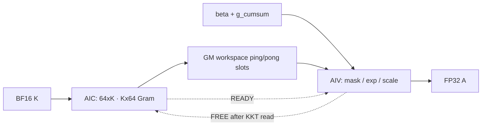

# ChunkScaledDotKkt Ascend C operator

这是 `ChunkScaledDotKkt` 的 Ascend C 竞赛实现与优化复盘仓库。根目录保存当前发布基线；`versions/` 保存四个有代表性的历史里程碑；`examples/`、`scripts/` 和 `results/` 分别保存本地验证入口、性能采集入口和经过裁剪的历史证据。


## 算子语义

输入：

- `k`: BF16，`[B, T, Hg, K]`
- `beta`: BF16，`[B, H, T]`
- `g_cumsum`: FP32，`[B, H, T]`
- `chunk_offsets`: INT32，一维 chunk 边界
- `chunk_size`: 当前固定为 64

输出 `A` 为 FP32，形状 `[B, H, T, 64]`。当前实现约束为 `B=1`、`K∈{128,256}`、`H % Hg == 0`。令 `R=H/Hg`，query head `h` 对应 `kvHead=floor(h/R)`。对一个有效 chunk `[s,e)`：

```text
G[i,j] = dot(K[s+i, kvHead, :], K[s+j, kvHead, :])

A[h,s+i,j] = beta[h,s+i] * exp(g[h,s+i]-g[h,s+j]) * G[i,j]
               if g[h,s+i]-g[h,s+j] < 0
             = 0 otherwise
```

`j >= e-s` 的 padding 列为 0。这里没有额外的位置下三角，也没有 `1/sqrt(K)`。

## 实现结构



一个 `(chunk, kvHead)` 的 Gram 只计算一次，再供该 KV head 对应的 `R` 个 query heads 复用。一个 AIC 与两个 AIV 组成 MIX 1:2 生产—消费流水；K=128/256 使用固定形状 direct MMAD 路径，后处理包含成对 head、指数因子化、延迟输出和特定工作负载调度。

## 快速开始

目标环境是 Linux/aarch64、CANN 9.0.0、Ascend 910B。先加载 CANN 环境：

```bash
source /home/developer/Ascend/cann-9.0.0/set_env.sh
export ASCEND_HOME_PATH=/home/developer/Ascend/cann-9.0.0
```

构建并安装自定义算子包：

```bash
bash build.sh -j8
```

构建测试程序并列出 case：

```bash
bash examples/run.sh --list
```

运行完整正确性回归：

```bash
bash scripts/run_kkt.sh correctness
```

运行性能用例或单 case：

```bash
bash scripts/run_kkt.sh perf --warmup 10 --repeat 50
bash scripts/run_kkt.sh case perf_official_like_k128
```

采集一个算子的 msprof 数据：

```bash
bash scripts/run_kkt.sh prof perf_official_like_k128
```

详细前置条件与命令见 [环境说明](docs/environment.md)、[测试指南](docs/testing.md) 和 [Profiling 指南](docs/profiling.md)。

## 仓库导览

| 路径 | 内容 |
| --- | --- |
| `op_host/`, `op_kernel/` | 当前发布基线 |
| `examples/` | aclnn 调用、CPU golden、正确性/性能/stress/profile cases |
| `scripts/` | 统一测试与 msprof/simulator 入口 |
| `versions/` | 4 个历史源码快照；当前根目录可视为 v05 |
| `docs/optimization.md` | 优化机制、适用条件、证据与反例的精炼版 |
| `docs/optimization_history_zh.md` | 1000 行完整优化历程与实验账本 |
| `docs/slides/` | 原始分享 PPTX 与 PDF |
| `results/` | 裁剪后的历史硬件 profile 与 simulator 汇总 |
| `legacy/` | 未纳入过时 UT 模板的原因与恢复位置 |

## 重要边界

- 根目录源码只声明支持 `ASCEND_COMPUTE_UNIT=ascend910b` / NPU arch 2201。
- 本地测试的 CPU golden 使用 BF16 输入还原，并以 `atol=1e-6` 或 `rtol=1e-5` 判定。
- `--no-check` 只适合采集，不能作为正确性证据。
- simulator 的多核、多流水线时间存在重叠，不能把 CSV 中所有指令时长直接相加当成端到端耗时。
- 原工作区的框架 UT 模板与当前 tiling ABI 不兼容，因此只记录、不发布。
- 本项目采用 MIT License；冠军思路的来源与待核对 attribution 见 `NOTICE.md`。

English summary: an Ascend C implementation of `ChunkScaledDotKkt` for Ascend 910B, with a curated optimization history, runnable aclnn validation harness, profiling scripts, and four source milestones. The release baseline still requires a clean target-device rebuild before publication.
